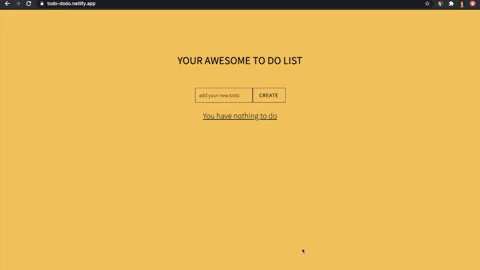

## [To Do List](https://todo-dodo.netlify.app/)

In December I finished Typescript course and decided to make a small app using React + Typescript.

You can go right to the [website](https://todo-dodo.netlify.app/) and see yourself how it works :pencil2:

## Why do I personally like it?

It's a simple app with all necessary features:

You can
- :memo: create a new to do item
- :black_nib: edit it
- :white_check_mark: mark it as done/undone
- :x: or delete it

:heavy_exclamation_mark: but more importantly if you refresh the page or even close the app, you won't lose your to do list! 
If you open the app again, all of your to do tasks will be still there.   

For such a small application I didn't want to set up a server or Redux, so I made a Custom Hook instead. 
